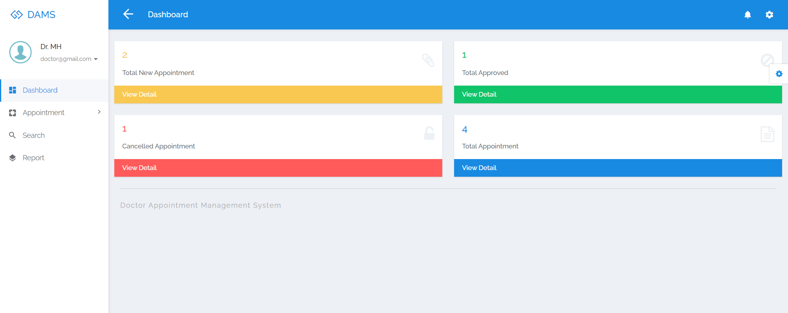
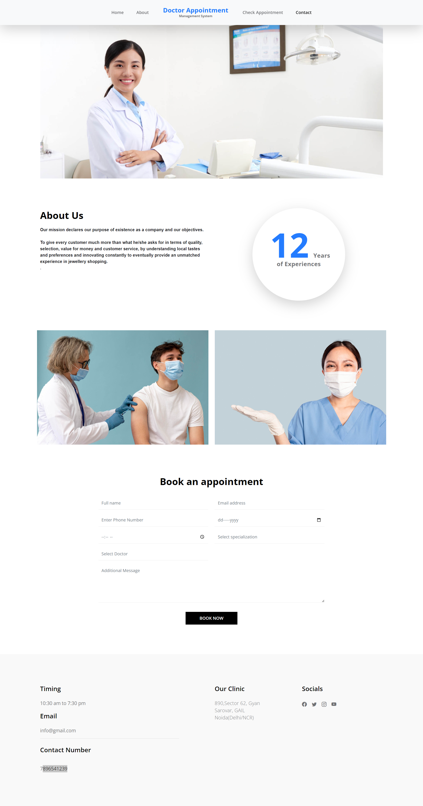

## How to run the Doctor Appointment Management System Project Using PHP and MySQL in Code Camp BD

1. Download the zip file

2. Extract the file and copy dams folder

3. Paste inside root directory(for xampp xampp/htdocs, for Laragon Laragon/www)

4. Open PHPMyAdmin (http://localhost/phpmyadmin)

5. Create a database with the name damsmsdb

6. Import damsmsdb.sql file(given inside the zip package in the SQL file folder)

7. Run the script http://localhost/"Project Name"

Doctor Login

Username: doctor@gmail.com

Password: Watch This Video

## Preview 
----------------------------

